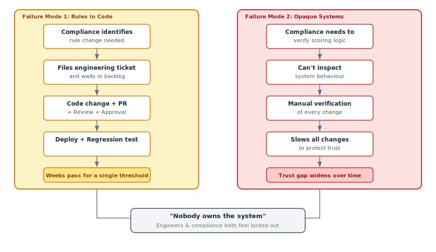
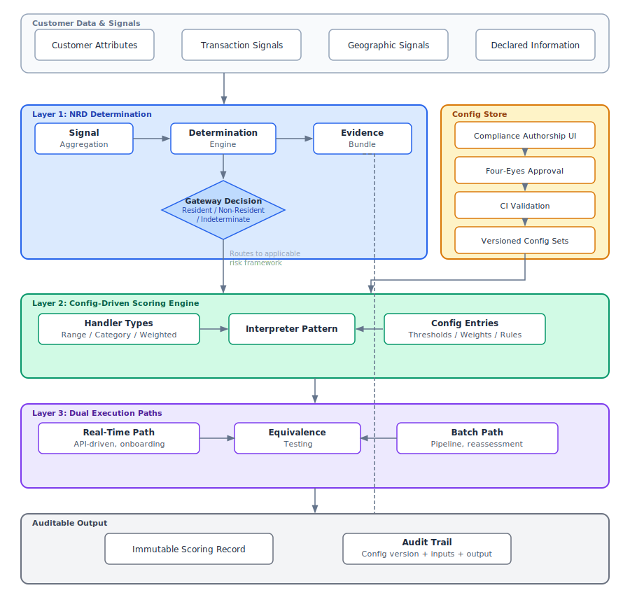

# Risk by Design: Why Your CRA and NRD Systems Deserve Real Architecture
 
Most fintech platforms have a Customer Risk Assessment system. Very few have a CRA *architecture*.
 
The difference matters. A CRA system is whatever collection of `if/else` statements and database lookups currently produces a risk score when a customer signs up. A CRA architecture is a deliberately designed, config-driven, auditable platform that treats risk assessment as a first-class domain — not an afterthought bolted onto onboarding.
 
I've spent the last several years designing and building both CRA and NRD (Non-Resident Determination) systems in production fintech environments. What I've learned is that the architectural decisions you make in these systems — how you separate scoring logic from business values, how you handle the residency determination problem, how you give compliance teams authorship over risk rules — have compounding consequences that show up months or years later, usually during an audit.
 
This article is the overview for a series called *Risk by Design*. It introduces the framework I've developed for thinking about CRA and NRD architecture, explains why the default approaches fail, and maps out the deeper topics I'll cover in follow-on articles. If you're an engineer building these systems or a product manager defining requirements for them, this is the starting point.
 
---
 
## The Problem: Why CRA Systems Fail Silently
 
Customer Risk Assessment is the process of evaluating how much risk a customer poses — typically in the context of Anti-Money Laundering (AML) and Know Your Customer (KYC) obligations. Every regulated fintech does it. The outputs drive decisions: which customers require Enhanced Due Diligence (EDD), which transactions trigger alerts, which accounts face restrictions.
 
Non-Resident Determination — NRD — is a related but architecturally distinct problem. NRD answers the question: is this customer a resident of the jurisdiction we're operating in? The answer changes which regulatory framework applies, which risk thresholds are relevant, and what monitoring obligations exist. Most systems treat NRD as a few extra fields in the CRA model. That's a mistake I'll unpack in a later article.
 
The default CRA implementation in most fintechs looks something like this: an engineer translates compliance requirements into code. Risk factors — transaction volume, account age, business type, geographic exposure — become conditional logic. Thresholds become hardcoded values. The whole thing ships as a service or a set of database queries, and it works. For a while.
 
Then it starts failing, in two predictable ways.
 
### Failure Mode 1: Rules Hardcoded in Engineering
 
When risk scoring logic lives in application code, every change to a threshold, a weight, or a risk category requires an engineering change. Compliance identifies that the geographic risk weight for a particular corridor should increase from 0.3 to 0.5. That's a code change, a pull request, a code review, a deployment, and a regression test. For a single number.
 
Multiply this across dozens of risk dimensions and you get a system where compliance intent is perpetually trapped in engineering backlogs. The compliance team knows what the rules should be. They can't change them without filing a ticket and waiting. This isn't a process problem — it's an architecture problem. The system was designed in a way that makes compliance dependent on engineering for every adjustment, no matter how small.
 
### Failure Mode 2: Compliance as Bottleneck
 
The second failure mode is the inverse. When compliance teams can't easily understand or verify what the system is doing, they become a bottleneck in a different way: they slow everything down because they can't trust the output. Every new risk dimension, every threshold change, every scoring adjustment requires extensive manual verification because the system doesn't produce artefacts that compliance can independently audit.
 
The result is a system that neither engineers nor compliance teams feel ownership over. Engineers see it as a black box of business rules they didn't choose. Compliance sees it as a black box of technical implementation they can't inspect. Both are right.
 

 
---
 
## The Architectural North Star: Config-Driven, Auditable, Compliance-Authorable
 
The framework I've developed rests on a single organising principle: **risk scoring logic should be data, not code**.
 
When I say "config-driven," I mean something specific. The scoring engine — the code that evaluates a customer against risk dimensions and produces an output — is generic. It knows how to evaluate ranges, match categories, aggregate weighted scores, and apply thresholds. What it doesn't know is the specific business rules: which ranges matter, what the weights are, where the thresholds sit. Those live in configuration — versioned, auditable, authored by compliance teams, and activated through a governed approval process.
 
This separation has three architectural consequences:
 
**Compliance teams can author risk rules directly.** Not by writing code, but through a structured interface — a backoffice tool where they can draft, review, and activate changes to scoring config. The system enforces validation (do the weights sum correctly? are there gaps in the threshold ranges? do all referenced categories exist?) so that compliance authors operate within safe boundaries without engineering gatekeeping.
 
**Every scoring decision is reconstructable.** Because config is versioned and scoring outputs are immutable, you can always answer the question: "What config was active when this customer was scored, and what inputs produced this output?" This isn't a reporting feature — it's an architectural property. The audit trail isn't built after the fact; it's a natural byproduct of how the system works.
 
**Scoring logic can execute in multiple contexts.** A config-driven engine can evaluate risk in real-time (during onboarding) and in batch (during periodic reassessment) using the same config, the same logic, and the same expected outputs. This dual-path capability is essential for any CRA system that needs to periodically re-score its customer base — which is every CRA system.
 
---
 
## The Framework: Four Architectural Layers
 
The *Risk by Design* framework has four layers. Each one is a deep-dive article in this series, but here's the map.
 
### Layer 1: The NRD Determination Layer
 
Non-Resident Determination is not a risk score — it's a gateway. The output of NRD changes which risk framework applies to a customer, which makes it architecturally prior to CRA scoring, not a component within it.
 
I've designed NRD as a signal aggregation system: declared address, transaction geography, counterparty patterns, and other residency indicators feed into a structured determination. The output is a classification (resident / non-resident / indeterminate) with an explicit evidence bundle — not a number, but a decision with a paper trail.
 
Why does this matter architecturally? Because a non-resident determination doesn't just add points to a risk score. It changes the applicable regulatory context. Different obligations, different EDD triggers, different monitoring thresholds. If NRD is embedded inside CRA scoring, you can't cleanly apply these routing decisions. If it's a separate layer, you can.
 
*Deep dive: "NRD Is a Gateway, Not a Score — And That Changes Everything"*
 
### Layer 2: The Config-Driven Scoring Engine
 
This is the core of the CRA system. The engine uses what I call an interpreter pattern: handler types define the grammar of risk evaluation (how to evaluate a range, how to match a category, how to aggregate a weighted set of dimensions), and config entries define the vocabulary (the specific thresholds, weights, and categories that reflect current compliance policy).
 
The key design decision is the separation between the interpreter (stable, engineering-owned code) and the config (dynamic, compliance-authored data). This separation enables compliance authorship — risk teams can change what the system does without changing how it works — and it produces a versioned config history that serves as a regulatory artefact.
 
The article on this layer also covers the governance model: four-eyes approval for config changes, CI-level validation, and the backoffice UI pattern that makes rule authorship accessible without making it unsafe.
 
*Deep dive: "Turning Risk Rules into Data: The Config-Driven Scoring Engine"*
 
### Layer 3: The Dual Execution Path
 
Most CRA systems need to score customers in two contexts: real-time (at onboarding, when an immediate determination is needed) and batch (during periodic reassessment, when the entire customer base is re-evaluated). These are different execution environments with different performance characteristics, but they must produce the same results for the same inputs.
 
The architectural pattern I use is a dual-path design with explicit equivalence guarantees. Both paths consume the same config. Both paths evaluate the same scoring logic. An equivalence test suite validates that, given the same entity snapshot, both paths produce identical outputs. This is the safety net that makes periodic reassessment trustworthy.
 
The entity snapshot pattern — what data you materialise, how frequently, and at what granularity — is the foundation of the batch path and one of the most consequential design decisions in the system.
 
*Deep dive: "One Score, Two Paths: Designing for Real-Time and Batch CRA Execution"*
 

 
---
 
## Who This Series Is For
 
If you're an **engineer** building or maintaining a CRA or NRD system, this series gives you architectural patterns you can apply directly — the interpreter model, the config store design, the equivalence testing strategy, the entity snapshot pattern. These aren't theoretical. They come from production systems handling real regulatory scrutiny.
 
If you're a **product manager** defining CRA or NRD requirements, this series gives you a framework for thinking about what "good" looks like. The conversation with your engineering team changes when you can articulate why compliance authorship matters architecturally, not just operationally. You stop asking for features and start asking for capabilities.
 
If you're a **compliance professional** frustrated by systems you can't inspect or change, this series shows you what's possible. Config-driven, compliance-authorable risk systems exist. They're not aspirational — they're buildable, and I'll show you the patterns that make them work.
 
---
 
## What Comes Next
 
The next article in this series — *NRD Is a Gateway, Not a Score* — dives into the Non-Resident Determination layer: why it deserves architectural independence from CRA, how to design it as a signal aggregation system, and how its output shapes the entire risk assessment framework.
 
After that, I'll cover the config-driven scoring engine, the dual execution model, and the full auditability story. Each article is self-contained but builds on the framework introduced here.
 
---
 
**Let's compare notes.**
 
If you're building or rearchitecting CRA, NRD, or compliance-authorable risk systems, I'd genuinely like to hear how you're approaching it. No pitch, no agenda — I'm interested in the problem space and the people working in it.